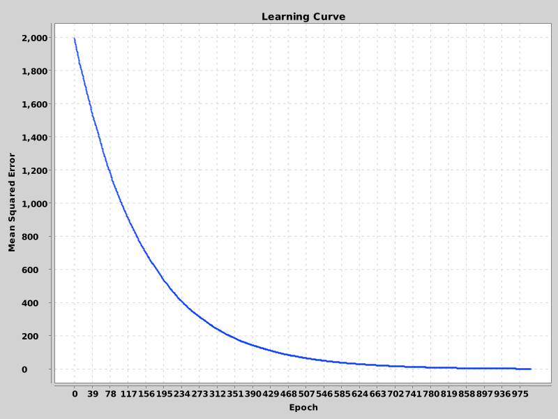

# Java LMS: Least Mean Squares Algorithm with Mini-Batch Training

This project implements the **Least Mean Squares (LMS)** algorithm in Java, designed for supervised learning tasks on large datasets using **mini-batch gradient descent**. It supports **lazy loading** from CSV files and optionally records the **mean squared error (MSE)** during training to generate a learning curve.

---

## Features

- 📁 **Efficient CSV Handling** — Lazy loading with `RandomAccessFile` for memory-efficient training.
- 📉 **Mini-Batch Gradient Descent** — Speeds up learning and allows for stochastic updates.
- 🎯 **Custom Target Column** — Select your desired prediction variable by name.
- 🧪 **Test Set Splitting** — Automatically separates a test set from training data.
- 🧠 **MSE Monitoring** — Optionally track and export MSE at each epoch.
- 📊 **Learning Curve Export** — Visualize training progress with XChart.

---

## Dependencies

This project uses the following libraries:

- [EJML](https://ejml.org/) — Linear algebra operations.
- [XChart](https://knowm.org/open-source/xchart/) — Plotting and exporting the learning curve.

## Usage

### 1. Generate a Synthetic Dataset and Train LMS

The `Main` class demonstrates how to generate a dataset and train the model:

```
public static void main(String[] args) throws IOException {
    String path = "";
    generateCsvDataset(10, 10000, path+ "regression_dataset.csv");
    LMS lms = new LMS(path+"regression_dataset.csv", 100, "y", null, 1000, 50, 0.001, true);
    lms.train();
    lms.exportLearningCurve(path + "learning_curve.png");
}
```

This will:

- Generate a dataset named regression_dataset.csv

- Train the LMS model

- Save the learning curve to learning_curve.png

Use `String path` to choose the learning_curve.png save path.

## Output



## License

MIT License — free to use, modify, and distribute.

## Author

Developed by João Lima
Leveraging Java, EJML, and XChart for educational and experimental ML systems.


